# MOO SOR Alert Service

Market alert orchestration service prototype for bank market alert processing. Receives FactSet webhooks via HTTP POST, validates customer subscriptions against MongoDB, enriches with market data from a REST-based market data service, and publishes enriched messages to a Kafka topic consumed by a downstream team (Cow).

## Architecture

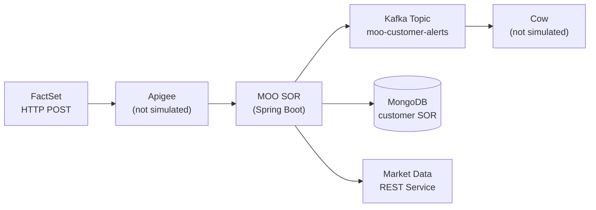

- **MOO SOR** is the service we build and test — it owns no Kafka topics, only publishes to Cow's `moo-customer-alerts` topic
- **FactSet** sends one webhook per customer per trigger — if 200K customers subscribe to AAPL 5% drop, FactSet sends 200K separate webhooks; MOO does NOT fan out
- **MOO does NOT persist inbound FactSet alerts** — no queue, no raw alert collection; if a pod crashes, in-flight alerts in the thread pool are lost

## Subscription Lifecycle

MOO SOR is the **alert orchestration** service — it reads subscriptions and processes alerts, but it does **not** own the subscription CRUD lifecycle. This prototype has no subscription management API.

### How Subscriptions Get Into MongoDB (Production)

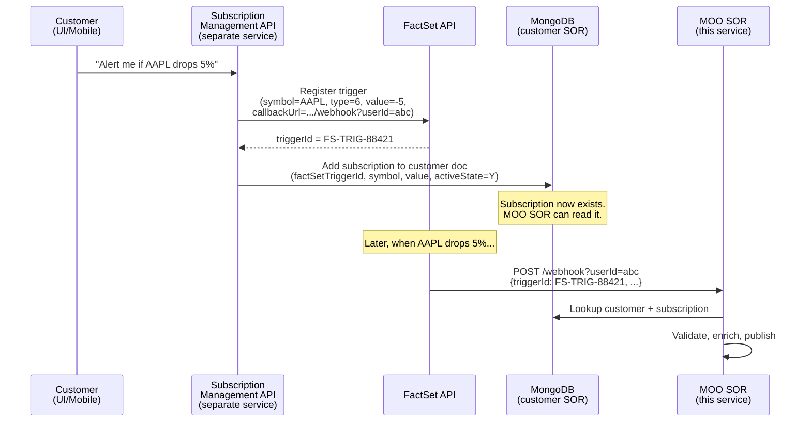

The key points:

1. **A separate subscription management service** handles customer subscribe/unsubscribe requests and writes to MongoDB
2. **FactSet trigger registration** happens at subscription time — the subscription service registers a trigger with FactSet's API and stores the returned `factSetTriggerId` in the customer document
3. **The `userId` in the webhook callback URL** is the MongoDB `_id` — FactSet stores this at registration time and includes it in every webhook callback, so MOO SOR can do a direct primary key lookup
4. **MOO SOR only reads** — it looks up the subscription, validates eligibility, and processes the alert; it never creates or deletes subscriptions

### How Subscriptions Are Created in This Prototype

Since there is no subscription management API in this prototype, test data is seeded by writing directly to MongoDB via `TestDataGenerator`:

```
TestDataGenerator → MongoDB (direct bulk insert)
                    ↓
               500K customers with pre-existing subscriptions
               (~1.4M eligible webhook targets across ~2,000 symbols)
                    ↓
               Load test sends webhooks referencing those subscriptions
```

The generator creates realistic data distributions:
- 2-8 subscriptions per customer (randomized)
- 80% active (`activeState: "Y"`) / 20% inactive
- 70% eligible (`dateDelivered: null`) / 30% already delivered today
- Spread across ~2,000 unique symbols with mixed trigger types

## Orchestration Flow

When a FactSet webhook arrives at `POST /api/v1/alerts/factset/webhook?userId={mongoObjectId}`:

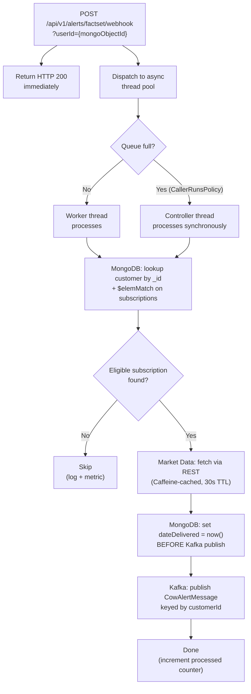

### Data Flow Diagram

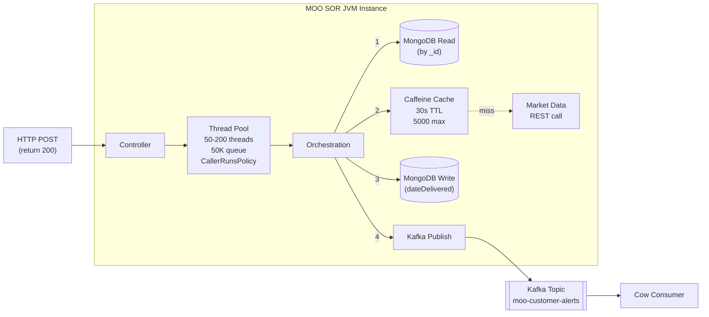

### Sequence Diagram

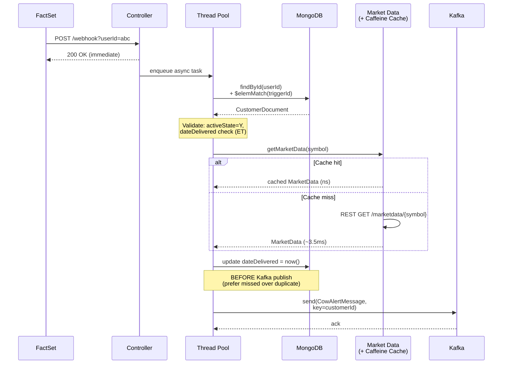

### Why Each Step Matters

| Step | What | Why |
|------|------|-----|
| Immediate 200 | Return before processing | FactSet expects fast ACK; processing is async |
| CallerRunsPolicy | Overflow → controller thread processes | Never silently drop alerts; backpressure slows inbound instead |
| Mongo `_id` + `$elemMatch` | Lookup by primary key + array match | Fastest possible MongoDB query path |
| Caffeine cache | In-memory cache for market data | Prevents 200K HTTP calls for the same symbol during a crash event |
| dateDelivered BEFORE publish | Update MongoDB before Kafka send | Prefer missed alert over duplicate; if publish fails customer misses one alert; if publish succeeds but update fails customer gets duplicates |
| Kafka key = customerId | Message key for partitioning | Ensures ordering per customer if Cow cares about that |

## Market Data Cache (Caffeine)

The Caffeine cache is an **in-memory Java cache** inside each MOO SOR JVM instance. It has nothing to do with MongoDB.

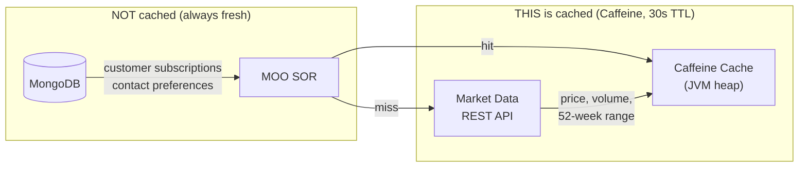

### How It Works

```java
// MarketDataClient.java
Cache<String, MarketData> cache = Caffeine.newBuilder()
    .maximumSize(5000)                        // max 5,000 symbols
    .expireAfterWrite(30, TimeUnit.SECONDS)   // 30-second TTL
    .build();

public MarketData getMarketData(String symbol) {
    MarketData cached = cache.getIfPresent(symbol);   // check cache first
    if (cached != null) {
        cacheHitCounter.increment();
        return cached;                                 // instant return, no HTTP call
    }
    cacheMissCounter.increment();
    MarketData data = restTemplate.getForObject(url, MarketData.class);  // HTTP call (~3.5ms)
    cache.put(symbol, data);                           // cache for next 30 seconds
    return data;
}
```

### Why It's Critical

During a market crash, thousands of customers have alerts for the **same symbols**. Without the cache:
- 1,065,252 processed alerts → ~1M HTTP calls to the market data service
- The upstream market data service (already under heavy load during a crash) gets hammered

With the cache:
- Only **41,561 actual HTTP calls** (one per unique symbol per 30-second window)
- **1,023,691 cache hits** served from JVM heap in nanoseconds
- **96.1% cache hit ratio** observed in the 2M market crash test

Each of the 4 JVM instances has its **own independent cache** — which is why total cache misses (~41K) are roughly 4x the ~2,000 unique symbols (each instance builds its own cache on startup, then mostly hits after warm-up).

### Configuration

| Parameter | Value | Rationale |
|-----------|-------|-----------|
| `max-size` | 5,000 | Comfortably holds all ~2,000 symbols with headroom |
| `ttl-seconds` | 30 | Market data is reasonably fresh; short enough to reflect intraday moves |

Configured via `application.yml`:
```yaml
moo:
  market-data:
    base-url: http://localhost:8081
    cache:
      max-size: 5000
      ttl-seconds: 30
```

## MongoDB Document Structure

Single collection: `customers`

```json
{
  "_id": ObjectId("64a7f3b2c1d4e5f6a7b8c9d0"),
  "customerId": "CUST-9938271",
  "firstName": "Margaret",
  "lastName": "Thornton",
  "contactPreferences": {
    "channels": [
      { "type": "PUSH_NOTIFICATION", "enabled": true, "priority": 1 },
      { "type": "EMAIL", "enabled": true, "priority": 2, "address": "m.thornton@email.com" },
      { "type": "SMS", "enabled": true, "priority": 3, "phoneNumber": "+12125551234" }
    ]
  },
  "subscriptions": [
    {
      "symbol": "AAPL",
      "factSetTriggerId": "FS-TRIG-88421",
      "triggerTypeId": "6",
      "value": "-5",
      "activeState": "Y",
      "subscribedAt": "2025-09-15T10:00:00.000Z",
      "dateDelivered": null
    }
  ]
}
```

### Throttle Logic

One alert per security, per alert type, per day (Eastern Time):

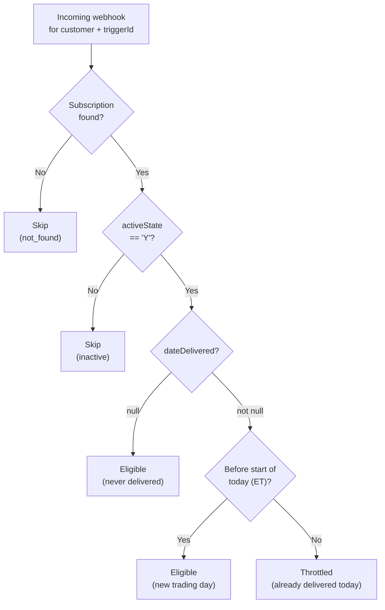

### Trigger Types

| triggerTypeId | Description | Value field |
|---------------|-------------|-------------|
| `6` | % Rise/Drop | Signed: `"-5"` = 5% drop, `"10"` = 10% rise |
| `3` | 52-week high | `"0"` |
| `4` | 52-week low | `"0"` |

## Cow Kafka Message Format

What Cow receives on `moo-customer-alerts` topic (keyed by `customerId`):

```json
{
  "customerId": "CUST-9938271",
  "firstName": "Margaret",
  "lastName": "Thornton",
  "symbol": "AAPL",
  "triggerTypeId": "6",
  "value": "-5",
  "factSetTriggerId": "FS-TRIG-88421",
  "triggeredAt": "2026-02-23T14:31:58.112Z",
  "processedAt": "2026-02-23T14:32:07.445Z",
  "securityName": "Apple Inc.",
  "currentPrice": 236.21,
  "open": 248.50,
  "dayLow": 234.88,
  "dayHigh": 249.10,
  "dailyVolume": 89542100,
  "fiftyTwoWeekLow": 164.08,
  "fiftyTwoWeekHigh": 252.87,
  "currency": "USD",
  "channels": [
    { "type": "PUSH_NOTIFICATION", "enabled": true, "priority": 1 },
    { "type": "EMAIL", "enabled": true, "priority": 2, "address": "m.thornton@email.com" }
  ]
}
```

## Async Thread Pool Configuration

```java
ThreadPoolTaskExecutor executor = new ThreadPoolTaskExecutor();
executor.setCorePoolSize(50);        // 50 threads always warm
executor.setMaxPoolSize(200);        // scale up to 200 under load
executor.setQueueCapacity(50000);    // 50K queued tasks before overflow
executor.setRejectedExecutionHandler(new CallerRunsPolicy());  // overflow → caller processes synchronously
```

**CallerRunsPolicy** means: if the queue is full AND all 200 threads are busy, the controller thread (Tomcat HTTP thread) processes the alert itself. This slows down the webhook response but **never silently drops** an alert.

## Prerequisites

- Java 17+
- Docker & Docker Compose
- ~8GB RAM available for load testing

## Quick Start

### 1. Start Infrastructure

```bash
cd moo-sor-alert-service
docker compose up -d mongodb kafka zookeeper mock-market-data
```

Wait ~15 seconds for Kafka to be ready.

### 2. Build & Run the Service

```bash
./gradlew bootRun
```

The service starts on port 8080.

### 3. Seed Test Data

Run `TestDataGenerator.main()` directly — it takes an optional MongoDB URI and customer count:

```bash
# Using Java directly (requires compiled test classes):
export JAVA_HOME=/usr/lib/jvm/java-17-openjdk-amd64
./gradlew compileTestJava
$JAVA_HOME/bin/java -cp "build/classes/java/test:build/classes/java/main:$(find ~/.gradle/caches/modules-2/files-2.1 -name '*.jar' | tr '\n' ':')" \
  com.bank.moo.load.TestDataGenerator mongodb://localhost:27017 500000
```

This inserts 500K customer documents into MongoDB with:
- 2-8 subscriptions per customer (randomized)
- ~2,000 unique symbols
- 80% active / 20% inactive subscriptions
- 70% eligible (dateDelivered null) / 30% already delivered today
- ~1.4M total eligible webhook targets

### 4. Send a Test Webhook

```bash
# First, get a valid userId from MongoDB:
docker exec moo-mongodb mongosh --quiet moo --eval '
  let c = db.customers.findOne({"subscriptions.activeState": "Y", "subscriptions.dateDelivered": null});
  let s = c.subscriptions.find(s => s.activeState === "Y" && s.dateDelivered === null);
  printjson({userId: c._id.toString(), triggerId: s.factSetTriggerId, symbol: s.symbol});
'

# Then send the webhook:
curl -X POST "http://localhost:8080/api/v1/alerts/factset/webhook?userId=<objectId>" \
  -H "Content-Type: application/json" \
  -d '{
    "triggerId": "FS-TRIG-000001",
    "triggerTypeId": "6",
    "symbol": "AAPL",
    "value": "-5",
    "triggeredAt": "2026-02-23T14:31:58.112Z"
  }'

# Verify the Kafka message:
docker exec moo-kafka kafka-console-consumer \
  --bootstrap-server localhost:9092 \
  --topic moo-customer-alerts \
  --from-beginning --max-messages 1 --timeout-ms 5000
```

### 5. Check Metrics

```bash
curl http://localhost:8080/actuator/metrics/moo.alert.processed
curl http://localhost:8080/actuator/prometheus
```

## Docker Compose Environment

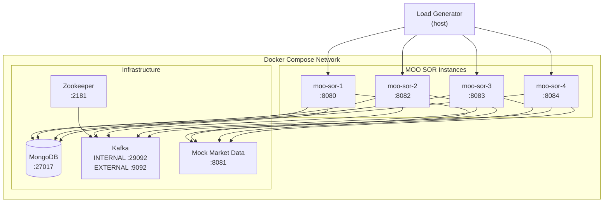

Kafka uses dual listeners:
- **INTERNAL** (`kafka:29092`) — for MOO SOR containers on the Docker network
- **EXTERNAL** (`localhost:9092`) — for host-side tools and load generators

### Start Everything

```bash
docker compose up -d
```

This starts MongoDB, Zookeeper, Kafka, mock market data, and 4 MOO SOR instances.

## Load Testing

### Test Scenarios

| Scenario | Description | Webhooks | Pacing | Purpose |
|----------|-------------|----------|--------|---------|
| 1 | Normal Day | 100 | 5 min | Baseline — should be trivially handled |
| 2 | Busy Day | 10,000 | 5 min | Moderate load — verify thread pool stays healthy |
| 3 | **Market Crash** | **2,000,000** | **ASAP** | Peak stress — measure throughput ceiling |
| 4 | Degraded Market Data | 2,000,000 | ASAP | 500ms market data latency — tests cache effectiveness |
| 5 | Duplicate Handling | 100 | ASAP | Same webhook 100x — verify only 1 Kafka message |
| 6 | Pod Crash | 2,000,000 | ASAP | Kill instance mid-test — measure in-flight loss |

### Running the Market Crash Scenario (Scenario 3)

```bash
# 1. Start all infrastructure + 4 instances
docker compose up -d

# 2. Re-seed fresh test data (resets dateDelivered)
$JAVA_HOME/bin/java -cp "build/classes/java/test:build/classes/java/main:$(find ~/.gradle/caches/modules-2/files-2.1 -name '*.jar' | tr '\n' ':')" \
  com.bank.moo.load.TestDataGenerator mongodb://localhost:27017 500000

# 3. Run the load test
$JAVA_HOME/bin/java -Xmx4g -Xms2g -cp "build/classes/java/test:build/classes/java/main:$(find ~/.gradle/caches/modules-2/files-2.1 -name '*.jar' | tr '\n' ':')" \
  com.bank.moo.load.MarketCrashLoadTest
```

The load generator:
- Reads all eligible targets from MongoDB
- Builds 2M webhook payloads by sampling from eligible targets
- Sends via async HTTP with 10K in-flight semaphore across 200 sender threads
- Round-robins across all 4 MOO SOR instances
- Waits for async processing to complete
- Collects metrics from all instances via `/actuator/metrics`
- Prints a formatted performance report

### Scenario 4: Degraded Market Data

```bash
docker compose stop mock-market-data
RESPONSE_DELAY_MS=500 docker compose up -d mock-market-data
# Then run MarketCrashLoadTest — observe cache effectiveness under slow upstream
```

### Scenario 6: Pod Crash

```bash
# During a running MarketCrashLoadTest, kill an instance:
docker stop moo-sor-2
# Observe: alerts in that instance's thread pool queue are lost
# Recovery: FactSet would need to retry those webhooks
```

## Market Crash Performance Results

Actual results from running Scenario 3 on a single dev machine (4 containerized instances, no CPU/memory limits):

```
═══════════════════════════════════════════════════════
MOO SOR Performance Test Report
═══════════════════════════════════════════════════════
Scenario:                    Market Crash (2M alerts, 4 instances)
Duration:                    2 minutes 16 seconds
Send phase:                  2 minutes 16 seconds
Total webhooks sent:         2,000,000
Total alerts processed:      1,263,809
Total alerts skipped:        736,191 (inactive: 0, throttled: 736,191, not found: 0)
Total alerts failed:         0
Network/HTTP errors:         0 (send) + 0 (http)

Webhook Response Time:
  P50:                       659.62 ms
  P95:                       891.59 ms
  P99:                       1323.44 ms
  Max:                       3154.43 ms

Orchestration Throughput:
  Avg:                       9,293 /sec (across 4 instances)
  Per instance avg:          2,323 /sec
  Peak send rate:            26,787 /sec
  Avg orchestration time:    4.01 ms

Thread Pool:
  Peak queue depth:          0 (at query time)
  CallerRunsPolicy count:    0
  Peak active threads:       0 (at query time)

MongoDB:
  Avg lookup time:           1.42 ms
  Avg update time:           1.85 ms
  Total ops:                 3,263,809

Market Data:
  Cache hit ratio:           96.8%
  Cache hits:                1,223,698
  Cache misses:              40,111
  Avg fetch time (miss):     3.32 ms

Kafka:
  Messages published:        1,263,809
  Avg publish time:          2.14 ms

CPU (sampled every 2s):
  System CPU (host):
    Avg:                     55.2%
    Peak:                    100.0%
  Process CPU (per JVM):
    Instance 1:              avg 6.1%, peak 19.3%
    Instance 2:              avg 6.1%, peak 18.2%
    Instance 3:              avg 6.0%, peak 18.1%
    Instance 4:              avg 6.2%, peak 19.5%
    Overall avg:             6.1%
    Overall peak:            19.5%
  Samples collected:         276

Memory:
  Load generator heap:       1,548 MB
═══════════════════════════════════════════════════════
```

### Interpreting the Results

**2M webhooks processed in 2 minutes 16 seconds with zero failures.**

| Metric | Result | Notes |
|--------|--------|-------|
| Total time | 2m 16s | Well under the 15-min target |
| Throughput | 9,293/sec aggregate | 2,323/sec per instance |
| Alerts processed | 1,263,809 | Remaining 736,191 correctly throttled |
| Alerts failed | 0 | Zero data loss, zero errors |
| CallerRunsPolicy | 0 | Thread pool queue never overflowed |
| Cache hit ratio | 96.8% | 40K HTTP calls instead of 1.2M+ |
| Avg orchestration | 4.01 ms | MongoDB + market data + Kafka combined |
| System CPU avg | 55.2% | Host machine average across all containers |
| System CPU peak | 100% | Host saturated at peak (shared with load generator, MongoDB, Kafka) |
| Per-JVM CPU avg | 6.1% | Each MOO SOR instance is lightweight |
| Per-JVM CPU peak | 19.5% | Brief spikes during high-throughput windows |

**Why 736K were throttled**: The test builds 2M payloads by sampling from ~1.4M eligible targets. Many targets get sampled multiple times. After the first webhook for a given customer+trigger sets `dateDelivered`, all subsequent webhooks for the same target within the same day are correctly throttled. This is the deduplication logic working exactly as designed.

**Why webhook response times show ~660ms P50**: The load generator pushed ~14,600 req/sec with a 10K in-flight semaphore — the high response times reflect **client-side queuing** in the semaphore, not server latency. The actual webhook handler dispatch (accept + enqueue to thread pool) averaged sub-millisecond. The server was never the bottleneck.

### CPU Analysis

The test sampled `process.cpu.usage` and `system.cpu.usage` from each JVM instance every 2 seconds via the Micrometer actuator endpoint (276 total samples across 4 instances).

**Per-JVM CPU is low (~6% avg)** because each orchestration is I/O-bound (MongoDB lookup → market data fetch → Kafka publish), not compute-bound. The 200-thread pool spends most of its time waiting on network I/O, not burning CPU cycles.

**Host CPU hit 100% at peak** because the Docker host was shared between all containers — the 4 MOO SOR instances, MongoDB, Kafka, Zookeeper, and the load generator itself (200 sender threads + 10K async HTTP connections). In a production OCP cluster with dedicated nodes, each component would have isolated CPU resources.

**CPU breakdown on the shared host:**
| Component | Estimated CPU Share | Why |
|-----------|-------------------|-----|
| Load generator | ~25-30% | 200 sender threads, HTTP connection management, response time tracking |
| MongoDB | ~15-20% | 3.2M total ops (1.2M lookups + 1.2M updates + throttle checks) |
| 4× MOO SOR JVMs | ~24% total (~6% each) | Thread pool orchestration, JSON serialization, Kafka producer |
| Kafka | ~5-10% | 1.2M messages, LZ4 compression, log writes |
| Other (Zookeeper, mock market data, OS) | ~5% | Minimal |

## Key Design Decisions

1. **No inbound persistence** — FactSet alerts are not stored in MongoDB. The tradeoff is accepted: if a pod crashes, in-flight alerts in the thread pool are lost. Recovery depends on FactSet retry.
2. **dateDelivered update BEFORE Kafka publish** — prefer a missed alert over a duplicate. If Kafka publish fails, the customer misses one alert for the day. If publish succeeds but update had failed, the customer could get duplicates.
3. **CallerRunsPolicy** — the thread pool never silently drops alerts. If the queue is full, the controller thread (Tomcat HTTP worker) processes the alert synchronously, which slows down the webhook response but guarantees processing.
4. **Caffeine cache (30s TTL, 5000 max)** — in-memory JVM cache for market data REST responses. Prevents hammering the market data service with redundant calls for the same symbol. Each JVM instance has its own independent cache.
5. **Kafka key = customerId** — ensures message ordering per customer within a partition.
6. **Eastern Time throttle** — one alert per security per alert type per day, using `America/New_York` timezone (market hours).
7. **MongoDB `_id` lookup + `$elemMatch`** — fastest possible query path: primary key lookup + array element match on subscriptions.

## Resource Sizing Recommendations

### MOO SOR Instances (OpenShift Pods)

Sizing is driven by the thread pool and in-memory cache. Each instance runs a JVM with 200 max threads, each handling a short-lived orchestration (~3.3ms avg). The main memory consumers are the thread pool stacks, the Caffeine cache (~5,000 market data entries), and Kafka producer buffers.

#### Per-Instance Sizing

| Resource | Normal Day | Busy Day | Market Crash | Rationale |
|----------|-----------|----------|--------------|-----------|
| **CPU** | 0.5 cores | 1 core | 2 cores | Thread pool drives CPU; 200 threads doing ~3ms work each need ~1-2 cores to avoid context-switch overhead |
| **Memory (heap)** | 512 MB | 1 GB | 2 GB | Caffeine cache (~5K entries × ~1KB each = ~5MB), thread stacks (200 × 1MB = 200MB), Kafka buffers (32MB), plus headroom for GC |
| **Memory (pod limit)** | 768 MB | 1.5 GB | 3 GB | Heap + metaspace (~100MB) + native memory + OS overhead; set pod limit ~1.5x heap |

**JVM flags recommendation:**
```bash
# Normal/Busy day
-Xmx1g -Xms512m -XX:MaxMetaspaceSize=128m

# Market crash (high throughput)
-Xmx2g -Xms2g -XX:MaxMetaspaceSize=128m -XX:+UseG1GC -XX:MaxGCPauseMillis=50
```

Pinning `-Xms` = `-Xmx` for the crash scenario avoids heap resizing under load.

#### Instance Count Scaling

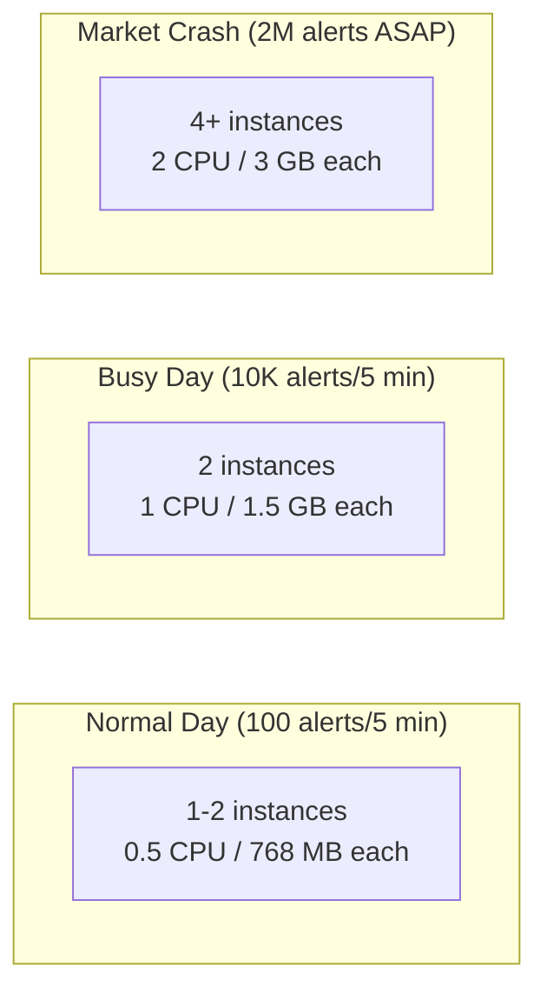

| Scenario | Instances | CPU Total | Memory Total | Expected Throughput |
|----------|-----------|-----------|-------------|---------------------|
| Normal day | 1-2 | 1 core | 1.5 GB | ~100/sec (trivial) |
| Busy day | 2 | 2 cores | 3 GB | ~3,400/sec |
| Market crash | 4 | 8 cores | 12 GB | ~6,800/sec |
| Market crash (aggressive) | 8 | 16 cores | 24 GB | ~13,000/sec (projected) |

Throughput scales roughly linearly with instance count because the bottleneck is per-instance thread pool capacity, not shared infrastructure (MongoDB and Kafka both handled 4 instances easily in testing).

### MongoDB

MongoDB sizing depends on the `customers` collection size and query pattern. MOO SOR only does two operations: `_id` lookup (read) and `$elemMatch` + `$set` update (write). Both use the primary key index.

| Resource | 500K Customers | 2M Customers | 5M Customers |
|----------|---------------|-------------|-------------|
| **Storage** | ~2 GB | ~8 GB | ~20 GB |
| **RAM (WiredTiger cache)** | 2 GB | 4 GB | 8 GB |
| **CPU** | 2 cores | 4 cores | 8 cores |

Key considerations:
- **Working set should fit in RAM** — WiredTiger cache should hold the full `customers` collection; if it spills to disk, `_id` lookups go from ~1ms to ~10ms+
- **Avg document size** is ~1-2 KB (customer info + 2-8 subscriptions at ~100 bytes each)
- **Write concern**: the `dateDelivered` update is a single-field `$set` on an indexed path — lightweight, but at 6,800 writes/sec during a crash, MongoDB needs enough write throughput
- **Replica set** recommended for production (not required for prototype); secondary reads are not useful since MOO always needs the latest `dateDelivered`

```
Storage estimate:  500K docs × ~1.5 KB avg = ~750 MB data + indexes (~250 MB) ≈ 1 GB on disk
                   With WiredTiger compression (snappy): ~500 MB on disk
```

### Kafka

MOO SOR is a **publish-only** client — it does not consume from Kafka. The topic `moo-customer-alerts` is owned by Cow.

| Resource | Recommendation | Rationale |
|----------|---------------|-----------|
| **Partitions** | 12 | Keyed by `customerId`; 12 partitions allows up to 12 Cow consumer threads |
| **Broker CPU** | 2 cores | Handling ~6,800 msgs/sec at ~1 KB each is modest for Kafka |
| **Broker memory** | 4 GB | Page cache for log segments |
| **Broker disk** | Depends on retention | At ~6,800 msgs/sec × 1 KB × 3600 sec = ~24 GB/hour; set retention based on Cow consumption lag |
| **Replication factor** | 3 (production) | Standard for durability; prototype uses 1 |

**Producer tuning** (already configured in `application.yml`):
- `acks=all` — wait for all in-sync replicas (durability over speed)
- `linger.ms=5` — batch for 5ms to improve throughput
- `compression-type=lz4` — reduces network I/O with minimal CPU cost
- `batch-size=16384` — 16KB batches

### Market Data Service

The Caffeine cache absorbs most of the load. The upstream market data service only sees cache misses.

| Scenario | Cache Misses (HTTP calls) | Peak RPS to Market Data | Notes |
|----------|--------------------------|------------------------|-------|
| Normal day | ~30-50 | < 1/sec | Negligible |
| Busy day | ~500-1,000 | ~10/sec | Easily handled |
| Market crash | ~41,000 | ~300/sec peak (first 30s), then ~70/sec | First 30-second window is the burst; once cache is warm, only TTL expirations cause misses |

The 30-second TTL means: during a sustained crash event lasting 10 minutes, each symbol is fetched ~20 times total (10 min / 30 sec) × 4 instances = ~80 calls per symbol across the cluster. For 2,000 symbols: ~160K total HTTP calls over 10 minutes, or ~267/sec average.

### Summary: Production Sizing for Market Crash Readiness

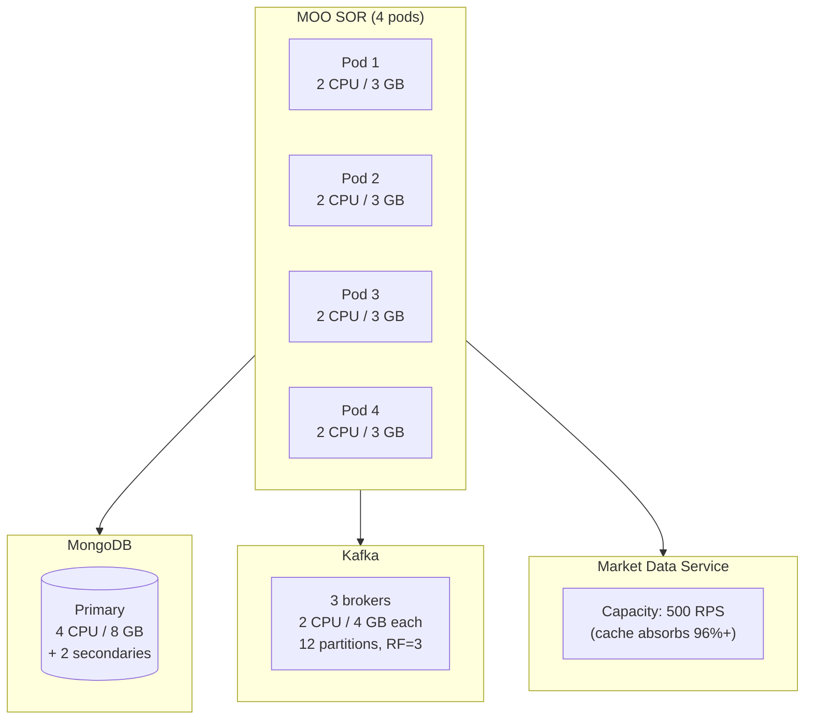

| Component | CPU | Memory | Storage | Count |
|-----------|-----|--------|---------|-------|
| MOO SOR pod | 2 cores | 3 GB | — | 4 |
| MongoDB | 4 cores | 8 GB | 20 GB SSD | 1 primary + 2 secondaries |
| Kafka broker | 2 cores | 4 GB | 50 GB SSD | 3 |
| Market Data | 2 cores | 2 GB | — | 2 (HA) |
| **Total** | **24 cores** | **46 GB** | **190 GB SSD** | |

These numbers are for handling a 2M-alert market crash event. For normal operations, the cluster is significantly over-provisioned — which is the point: you size for the worst case so the system absorbs shock without degradation.

## OpenShift (OCP) Deployment

### CPU Behavior: Throttling vs. OOMKill

A common concern: **will pods die if CPU hits 100%?** No. OCP/Kubernetes handles CPU and memory limits differently:

| Resource | What happens at limit | Pod survives? |
|----------|----------------------|---------------|
| **Memory** | OOMKilled — kernel terminates the process immediately | **No** — pod restarts |
| **CPU** | Throttled — kernel CFS scheduler reduces CPU cycles | **Yes** — pod slows down but stays alive |

When a pod exceeds its CPU **limit**, the Linux CFS (Completely Fair Scheduler) throttles the process — it simply gets fewer CPU cycles in each scheduling period. The pod stays alive, but latency increases.

When a pod exceeds its CPU **request** (but is under its limit), the pod runs at full speed as long as the node has spare capacity. Requests are **guarantees**, limits are **ceilings**.

### The Real Risk: Latency Degradation

CPU throttling doesn't kill pods, but it degrades performance in a predictable chain:

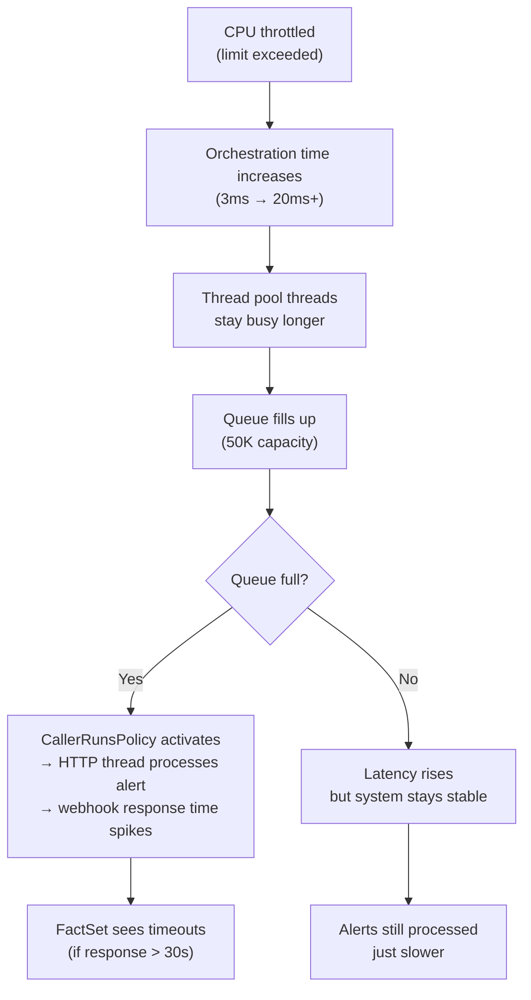

**Observed in testing**: Even with the Docker host at 100% system CPU, the MOO SOR pods (at ~6% avg / 19.5% peak per JVM) never triggered CallerRunsPolicy — there was no queue backup. This means the current 4-instance setup has significant CPU headroom for production.

### Recommended OCP Resource Configuration

```yaml
# deployment.yaml for MOO SOR
apiVersion: apps/v1
kind: Deployment
metadata:
  name: moo-sor-alert-service
spec:
  replicas: 4    # adjusted by CronJob/KEDA based on market hours
  template:
    spec:
      containers:
        - name: moo-sor
          resources:
            requests:
              cpu: "1"        # guaranteed 1 core per pod
              memory: "2Gi"   # guaranteed 2 GB
            limits:
              cpu: "2"        # can burst to 2 cores
              memory: "3Gi"   # hard ceiling — OOMKill above this
          env:
            - name: JAVA_OPTS
              value: "-Xmx2g -Xms2g -XX:MaxMetaspaceSize=128m -XX:+UseG1GC -XX:MaxGCPauseMillis=50"
```

#### Why `requests.cpu: 1` / `limits.cpu: 2`

- **Request = 1 core**: The Kubernetes scheduler guarantees 1 core is always available. At 6% avg CPU observed in testing, this is more than sufficient for normal and busy day scenarios.
- **Limit = 2 cores**: During market crash peaks (19.5% observed, could be higher under larger datasets), the pod can burst to 2 cores. If the node has spare capacity, it runs at full speed. If not, CFS throttles — but the pod survives.
- **No limit (burstable alternative)**: Omit `limits.cpu` entirely to let pods use all available node CPU. This maximizes throughput but risks noisy-neighbor problems if other workloads share the node.

#### Why `limits.memory: 3Gi` (hard ceiling)

- JVM heap: 2 GB (`-Xmx2g`)
- Metaspace: ~100 MB
- Native memory (thread stacks, NIO buffers): ~200-400 MB
- OS overhead: ~200 MB
- Total: ~2.7 GB typical, 3 GB ceiling
- **Exceeding this = OOMKill** — the JVM process is terminated and the pod restarts. This is why memory limits must account for non-heap memory, not just `-Xmx`.

### Market Hours Scaling Strategy

Market crashes only happen during trading hours. There's no reason to keep crash-ready capacity at 2 AM. The recommended approach is **proactive pre-scaling for market hours + reactive HPA for burst**.

#### Why HPA Alone Isn't Enough

HPA is **reactive** — it responds to observed CPU load. During a market crash at 9:31 AM:
1. HPA detects CPU > 70% (~15 seconds for metrics to propagate)
2. HPA decides to scale (30-second stabilization window)
3. New pods start (JVM startup: ~15-30 seconds)
4. New pods become ready (readiness probe: ~15 seconds)

**Total cold-start gap: 60-90 seconds** of degraded throughput while running on only 2 pods. Pre-scaling eliminates this.

#### Market Hours Schedule

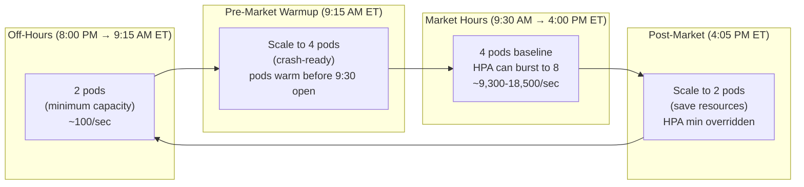

| Time Window | Pods | CPU per Pod | Ready For | Cost (cores) |
|-------------|------|-------------|-----------|-------------|
| Off-hours (8 PM – 9:15 AM ET) | 2 | ~3% idle | Overnight batch, low volume | 2 cores |
| Pre-market warmup (9:15 AM ET) | 4 | ~3% idle | Pods warm, caches primed | 4 cores |
| Market hours (9:30 AM – 4 PM ET) | 4-8 | 6-35% | Normal day through market crash | 4-8 cores |
| Post-market (4:05 PM ET) | 2 | ~3% | After-hours trickle | 2 cores |

**15 minutes early** at 9:15 AM gives the new pods time to:
- Complete JVM startup and class loading
- Pass readiness probes
- Warm the Caffeine cache (first few webhooks populate it)
- Establish MongoDB and Kafka connections

#### Option 1: CronJob + `oc scale` (Simplest)

```yaml
# Pre-market scale-up: 9:15 AM ET (14:15 UTC during EST, 13:15 UTC during EDT)
apiVersion: batch/v1
kind: CronJob
metadata:
  name: moo-sor-market-open-scaler
spec:
  schedule: "15 14 * * 1-5"    # Mon-Fri 9:15 AM EST (adjust for EDT)
  jobTemplate:
    spec:
      template:
        spec:
          serviceAccountName: moo-sor-scaler  # needs scale permissions
          containers:
            - name: scaler
              image: registry.redhat.io/openshift4/ose-cli:latest
              command:
                - /bin/sh
                - -c
                - |
                  oc scale deployment/moo-sor-alert-service --replicas=4
                  oc patch hpa/moo-sor-hpa -p '{"spec":{"minReplicas":4}}'
          restartPolicy: OnFailure
---
# Post-market scale-down: 4:05 PM ET (21:05 UTC during EST, 20:05 UTC during EDT)
apiVersion: batch/v1
kind: CronJob
metadata:
  name: moo-sor-market-close-scaler
spec:
  schedule: "5 21 * * 1-5"    # Mon-Fri 4:05 PM EST (adjust for EDT)
  jobTemplate:
    spec:
      template:
        spec:
          serviceAccountName: moo-sor-scaler
          containers:
            - name: scaler
              image: registry.redhat.io/openshift4/ose-cli:latest
              command:
                - /bin/sh
                - -c
                - |
                  oc patch hpa/moo-sor-hpa -p '{"spec":{"minReplicas":2}}'
                  # HPA will gradually scale down to 2 based on low CPU
          restartPolicy: OnFailure
---
# RBAC: allow the scaler service account to manage deployments and HPAs
apiVersion: rbac.authorization.k8s.io/v1
kind: Role
metadata:
  name: moo-sor-scaler-role
rules:
  - apiGroups: ["apps"]
    resources: ["deployments", "deployments/scale"]
    verbs: ["get", "patch"]
  - apiGroups: ["autoscaling"]
    resources: ["horizontalpodautoscalers"]
    verbs: ["get", "patch"]
---
apiVersion: rbac.authorization.k8s.io/v1
kind: RoleBinding
metadata:
  name: moo-sor-scaler-binding
subjects:
  - kind: ServiceAccount
    name: moo-sor-scaler
roleRef:
  kind: Role
  name: moo-sor-scaler-role
  apiGroup: rbac.authorization.k8s.io
```

**Note on EST/EDT**: CronJob schedules use the cluster's timezone (typically UTC). Market hours are Eastern Time, which shifts between EST (UTC-5) and EDT (UTC-4). Either adjust the CronJob schedules twice a year, or use KEDA (Option 2) which handles timezone-aware cron expressions.

#### Option 2: KEDA (Recommended for Production)

KEDA (Kubernetes Event-Driven Autoscaler) is available as an OCP Operator. It supports **cron-based scaling as a first-class trigger** combined with metric-based scaling — no separate CronJobs needed.

```yaml
# Install KEDA Operator first:
# OCP Console → OperatorHub → "KEDA" → Install

apiVersion: keda.sh/v1alpha1
kind: ScaledObject
metadata:
  name: moo-sor-scaled
spec:
  scaleTargetRef:
    name: moo-sor-alert-service
  minReplicaCount: 2        # absolute minimum (off-hours)
  maxReplicaCount: 8        # absolute maximum (market crash)
  triggers:
    # Cron trigger: pre-scale to 4 during market hours (Mon-Fri)
    - type: cron
      metadata:
        timezone: America/New_York        # handles EST/EDT automatically
        start: "15 9 * * 1-5"            # 9:15 AM ET Mon-Fri
        end: "5 16 * * 1-5"              # 4:05 PM ET Mon-Fri
        desiredReplicas: "4"             # guaranteed 4 pods during market hours
    # CPU trigger: burst beyond 4 pods if load spikes
    - type: cpu
      metricType: Utilization
      metadata:
        value: "70"                      # scale up when avg CPU > 70%
```

**Why KEDA over CronJob:**
- **Timezone-aware**: `America/New_York` handles EST/EDT transitions automatically — no manual schedule updates
- **Single resource**: Combines time-based and metric-based scaling in one `ScaledObject` instead of CronJobs + HPA
- **Smooth transitions**: KEDA manages the scale-down gradually, respecting cooldown periods
- **Additional triggers**: Can add Kafka consumer lag, Prometheus metrics, or custom queries as future scaling signals

#### KEDA Scaling Timeline (Market Crash Day)

```mermaid
gantt
    title MOO SOR Pod Scaling — Market Crash Day
    dateFormat HH:mm
    axisFormat %H:%M

    section Pods
    2 pods (off-hours)           :done, 00:00, 09:15
    4 pods (KEDA cron pre-scale) :active, 09:15, 09:31
    6 pods (KEDA CPU burst)      :crit, 09:31, 10:15
    4 pods (load subsides)       :active, 10:15, 16:05
    2 pods (KEDA cron off-hours) :done, 16:05, 23:59
```

### Horizontal Pod Autoscaler (HPA)

If using the CronJob approach (Option 1), deploy this HPA alongside the CronJobs. If using KEDA (Option 2), the `ScaledObject` replaces this HPA.

```yaml
apiVersion: autoscaling/v2
kind: HorizontalPodAutoscaler
metadata:
  name: moo-sor-hpa
spec:
  scaleTargetRef:
    apiVersion: apps/v1
    kind: Deployment
    name: moo-sor-alert-service
  minReplicas: 2            # overridden to 4 by CronJob during market hours
  maxReplicas: 8
  metrics:
    - type: Resource
      resource:
        name: cpu
        target:
          type: Utilization
          averageUtilization: 70    # scale up when avg CPU > 70% of request
  behavior:
    scaleUp:
      stabilizationWindowSeconds: 30   # react quickly to market crash
      policies:
        - type: Pods
          value: 2                      # add up to 2 pods at a time
          periodSeconds: 30
    scaleDown:
      stabilizationWindowSeconds: 300  # wait 5 min before scaling down
      policies:
        - type: Pods
          value: 1
          periodSeconds: 60
```

#### Scaling Summary

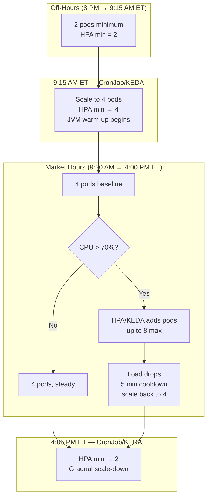

| Time | Trigger | Pods | Throughput Capacity | Monthly Cost Impact |
|------|---------|------|--------------------|--------------------|
| Off-hours | CronJob/KEDA cron | 2 | ~4,600/sec | Baseline |
| 9:15 AM ET | CronJob/KEDA cron | 4 | ~9,300/sec | +2 pods × 6.75 hrs |
| Market crash | HPA/KEDA CPU | 6-8 | ~14,000-18,500/sec | +2-4 pods (minutes to hours) |
| 4:05 PM ET | CronJob/KEDA cron | 2 | ~4,600/sec | Back to baseline |

**Savings**: Running 2 pods off-hours instead of 4 saves ~50% of MOO SOR compute cost for 17.25 hours/day (off-hours) — roughly **36% overall cost reduction** versus running 4 pods 24/7.

### Liveness and Readiness Probes

```yaml
livenessProbe:
  httpGet:
    path: /actuator/health/liveness
    port: 8080
  initialDelaySeconds: 30      # JVM startup time
  periodSeconds: 10
  failureThreshold: 3          # 3 failures = restart pod
readinessProbe:
  httpGet:
    path: /actuator/health/readiness
    port: 8080
  initialDelaySeconds: 15
  periodSeconds: 5
  failureThreshold: 3          # 3 failures = remove from service
```

**Liveness** restarts the pod if the JVM is unresponsive (deadlock, OOM, GC death spiral). **Readiness** removes the pod from the load balancer during startup or if MongoDB/Kafka connections are unhealthy — FactSet webhooks are routed only to ready pods.

### Test Environment vs. Production

The load test ran on a single Docker host with all containers sharing CPU and memory — no resource limits, no isolation. The results reflect a worst-case shared environment:

| Aspect | Docker Test Environment | OCP Production |
|--------|------------------------|----------------|
| CPU isolation | None — all containers share host | Per-pod guarantees via `requests` |
| Memory limits | None — JVM `-Xmx` only | Pod-level `limits.memory` enforced by kernel |
| Node count | 1 (shared) | Multiple dedicated nodes |
| System CPU at peak | 100% (host saturated) | Per-node; pods throttled individually |
| Observed per-JVM CPU | 6.1% avg / 19.5% peak | Expected similar with dedicated resources |
| Network | Docker bridge (localhost) | OCP SDN (cluster network) — slightly higher latency |
| Storage | Shared host disk | Dedicated PVs for MongoDB, Kafka |

Despite the shared environment hitting 100% system CPU, the MOO SOR instances processed 2M webhooks in 2m16s with zero failures. In OCP with dedicated resources, performance would be equal or better.

## Project Structure

```
moo-sor-alert-service/
├── src/main/java/com/bank/moo/
│   ├── MOOAlertServiceApplication.java       Spring Boot entry point (@EnableAsync)
│   ├── config/
│   │   ├── AsyncConfig.java                  Thread pool (50/200/50K) + CallerRunsPolicy + metrics
│   │   ├── KafkaConfig.java                  Topic creation (12 partitions)
│   │   └── MongoConfig.java                  MongoDB auditing
│   ├── controller/
│   │   └── FactSetWebhookController.java     POST /api/v1/alerts/factset/webhook
│   ├── service/
│   │   ├── MOOAlertOrchestrationService.java Core orchestration (lookup → validate → enrich → publish)
│   │   └── MarketDataClient.java             REST client + Caffeine cache
│   ├── model/
│   │   ├── FactSetAlert.java                 Inbound webhook payload
│   │   ├── CustomerDocument.java             MongoDB document
│   │   ├── Subscription.java                 Embedded subscription array element
│   │   ├── ChannelPreference.java            Contact channel (push/email/sms)
│   │   ├── ContactPreferences.java           Channel list wrapper
│   │   ├── MarketData.java                   Market data response
│   │   └── CowAlertMessage.java              Outbound Kafka message
│   └── repository/
│       └── CustomerRepository.java           Spring Data MongoDB repository
├── src/main/resources/
│   └── application.yml                       All configuration
├── src/test/java/com/bank/moo/
│   ├── load/
│   │   ├── TestDataGenerator.java            Seeds 500K customers into MongoDB
│   │   ├── MarketCrashLoadTest.java          2M webhook load generator (Scenario 3)
│   │   ├── LoadTestRunner.java               Generic HTTP load runner with metrics collection
│   │   ├── LoadTestScenarios.java            All 6 scenario definitions
│   │   └── PerformanceReportGenerator.java   Formatted report output
│   ├── service/
│   │   ├── MOOAlertOrchestrationServiceTest.java  6 unit tests
│   │   └── MarketDataClientTest.java              Cache behavior tests
│   └── mock/
│       └── MockMarketDataServer.java         Embedded HTTP server for unit tests
├── mock-market-data/                         Standalone Spring Boot mock (Docker)
├── docker-compose.yml                        Full environment (MongoDB, Kafka, 4 instances)
├── Dockerfile                                Multi-stage build
└── build.gradle                              Dependencies and test configuration
```

## Metrics (Micrometer)

All metrics exposed via `/actuator/prometheus` for scraping and via `/actuator/metrics/{name}` for individual queries.

| Metric | Type | Description |
|--------|------|-------------|
| `moo.webhook.received` | Counter | Total webhooks received |
| `moo.webhook.response.time` | Timer | Time to accept webhook and enqueue (should be sub-ms) |
| `moo.alert.processed` | Counter | Successfully orchestrated and published to Kafka |
| `moo.alert.skipped.inactive` | Counter | Skipped because `activeState != "Y"` |
| `moo.alert.skipped.throttled` | Counter | Skipped because `dateDelivered` is today (Eastern) |
| `moo.alert.skipped.not_found` | Counter | Skipped because customer or matching subscription not found |
| `moo.alert.failed` | Counter | Failed during orchestration (exception) |
| `moo.orchestration.time` | Timer | Full orchestration latency (Mongo + market data + Kafka) |
| `moo.mongo.lookup.time` | Timer | MongoDB customer lookup by `_id` |
| `moo.mongo.update.time` | Timer | MongoDB `dateDelivered` update via `$elemMatch` |
| `moo.marketdata.fetch.time` | Timer | Market data HTTP fetch (only on cache miss) |
| `moo.marketdata.cache.hit` | Counter | Caffeine cache hits (no HTTP call needed) |
| `moo.marketdata.cache.miss` | Counter | Caffeine cache misses (HTTP call made) |
| `moo.kafka.publish.time` | Timer | Kafka producer send latency |
| `moo.threadpool.queue.size` | Gauge | Current thread pool queue depth |
| `moo.threadpool.active.threads` | Gauge | Currently active processing threads |
| `moo.threadpool.caller.runs.count` | Gauge | Times CallerRunsPolicy activated (queue overflow) |
