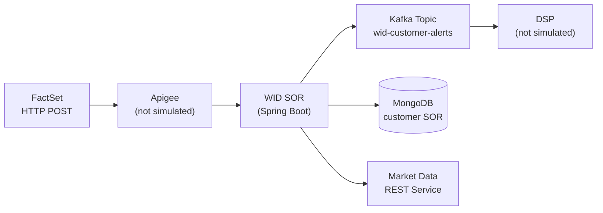
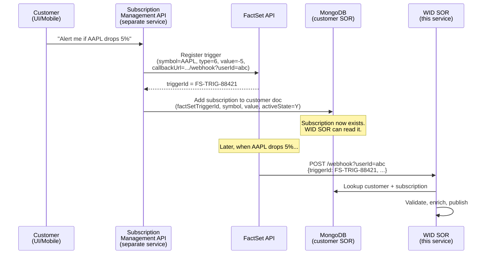
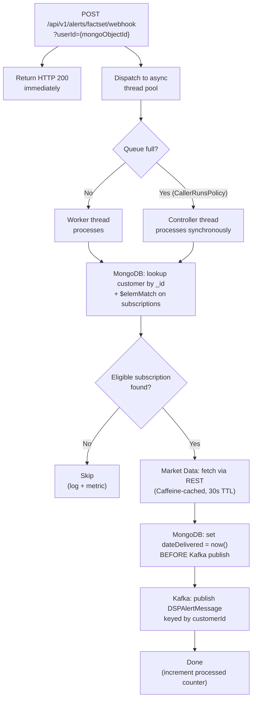
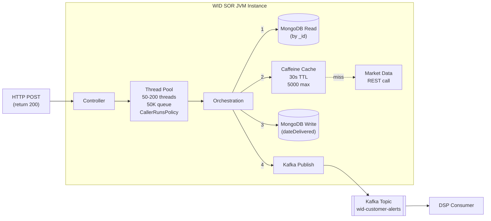
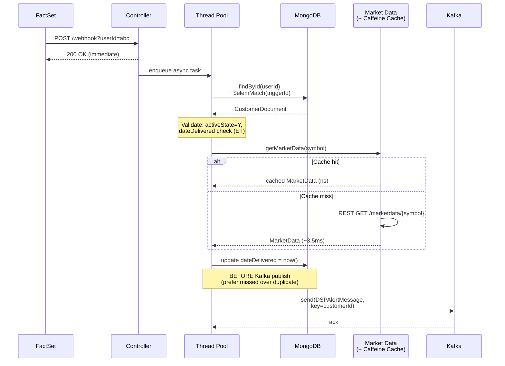
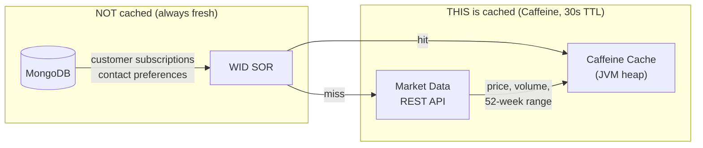
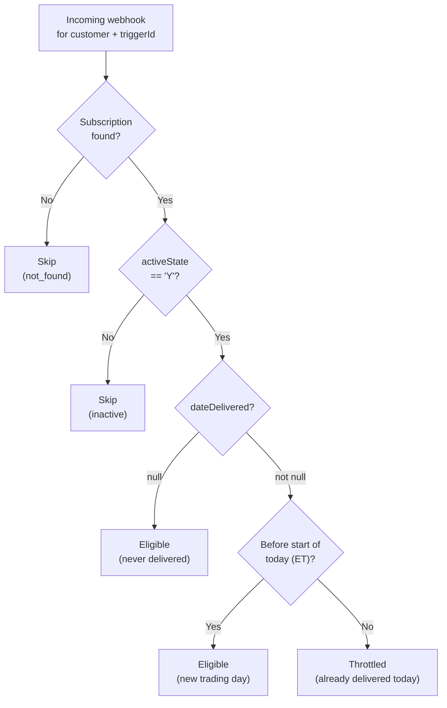
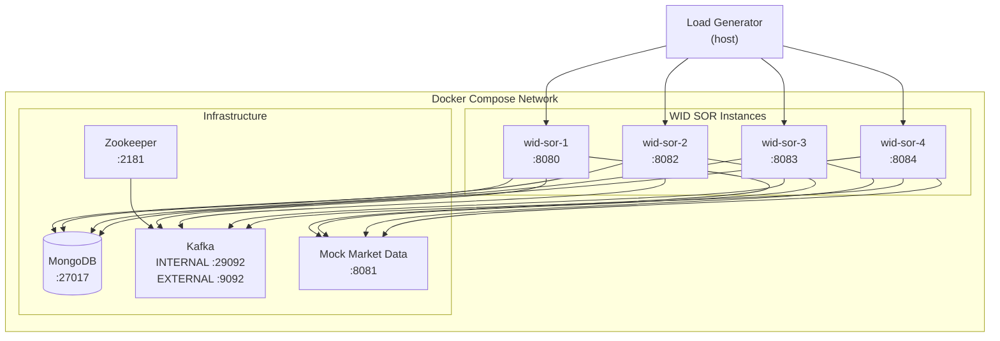

# WID SOR Alert Service

Market alert orchestration service prototype for bank market alert processing. Receives FactSet webhooks via HTTP POST, validates customer subscriptions against MongoDB, enriches with market data from a REST-based market data service, and publishes enriched messages to a Kafka topic consumed by a downstream team (DSP).

## Architecture



- **WID SOR** is the service we build and test — it owns no Kafka topics, only publishes to DSP's `wid-customer-alerts` topic
- **FactSet** sends one webhook per customer per trigger — if 200K customers subscribe to AAPL 5% drop, FactSet sends 200K separate webhooks; WID does NOT fan out
- **WID does NOT persist inbound FactSet alerts** — no queue, no raw alert collection; if a pod crashes, in-flight alerts in the thread pool are lost

## Subscription Lifecycle

WID SOR is the **alert orchestration** service — it reads subscriptions and processes alerts, but it does **not** own the subscription CRUD lifecycle. This prototype has no subscription management API.

### How Subscriptions Get Into MongoDB (Production)



The key points:

1. **A separate subscription management service** handles customer subscribe/unsubscribe requests and writes to MongoDB
2. **FactSet trigger registration** happens at subscription time — the subscription service registers a trigger with FactSet's API and stores the returned `factSetTriggerId` in the customer document
3. **The `userId` in the webhook callback URL** is the MongoDB `_id` — FactSet stores this at registration time and includes it in every webhook callback, so WID SOR can do a direct primary key lookup
4. **WID SOR only reads** — it looks up the subscription, validates eligibility, and processes the alert; it never creates or deletes subscriptions

### How Subscriptions Are Created in This Prototype

Since there is no subscription management API in this prototype, test data is seeded by writing directly to MongoDB via `TestDataGenerator`:

```
TestDataGenerator → MongoDB (direct bulk insert)
                    ↓
               500K customers with pre-existing subscriptions
               (~1.4M eligible webhook targets across ~2,000 symbols)
                    ↓
               Load test sends webhooks referencing those subscriptions
```

The generator creates realistic data distributions:
- 2-8 subscriptions per customer (randomized)
- 80% active (`activeState: "Y"`) / 20% inactive
- 70% eligible (`dateDelivered: null`) / 30% already delivered today
- Spread across ~2,000 unique symbols with mixed trigger types

## Orchestration Flow

When a FactSet webhook arrives at `POST /api/v1/alerts/factset/webhook?userId={mongoObjectId}`:



### Data Flow Diagram



### Sequence Diagram



### Why Each Step Matters

| Step | What | Why |
|------|------|-----|
| Immediate 200 | Return before processing | FactSet expects fast ACK; processing is async |
| CallerRunsPolicy | Overflow → controller thread processes | Never silently drop alerts; backpressure slows inbound instead |
| Mongo `_id` + `$elemMatch` | Lookup by primary key + array match | Fastest possible MongoDB query path |
| Caffeine cache | In-memory cache for market data | Prevents 200K HTTP calls for the same symbol during a crash event |
| dateDelivered BEFORE publish | Update MongoDB before Kafka send | Prefer missed alert over duplicate; if publish fails customer misses one alert; if publish succeeds but update fails customer gets duplicates |
| Kafka key = customerId | Message key for partitioning | Ensures ordering per customer if DSP cares about that |

## Market Data Cache (Caffeine)

The Caffeine cache is an **in-memory Java cache** inside each WID SOR JVM instance. It has nothing to do with MongoDB.



### How It Works

```java
// MarketDataClient.java
Cache<String, MarketData> cache = Caffeine.newBuilder()
    .maximumSize(5000)                        // max 5,000 symbols
    .expireAfterWrite(30, TimeUnit.SECONDS)   // 30-second TTL
    .build();

public MarketData getMarketData(String symbol) {
    MarketData cached = cache.getIfPresent(symbol);   // check cache first
    if (cached != null) {
        cacheHitCounter.increment();
        return cached;                                 // instant return, no HTTP call
    }
    cacheMissCounter.increment();
    MarketData data = restTemplate.getForObject(url, MarketData.class);  // HTTP call (~3.5ms)
    cache.put(symbol, data);                           // cache for next 30 seconds
    return data;
}
```

### Why It's Critical

During a market crash, thousands of customers have alerts for the **same symbols**. Without the cache:
- 1,065,252 processed alerts → ~1M HTTP calls to the market data service
- The upstream market data service (already under heavy load during a crash) gets hammered

With the cache:
- Only **41,561 actual HTTP calls** (one per unique symbol per 30-second window)
- **1,023,691 cache hits** served from JVM heap in nanoseconds
- **96.1% cache hit ratio** observed in the 2M market crash test

Each of the 4 JVM instances has its **own independent cache** — which is why total cache misses (~41K) are roughly 4x the ~2,000 unique symbols (each instance builds its own cache on startup, then mostly hits after warm-up).

### Configuration

| Parameter | Value | Rationale |
|-----------|-------|-----------|
| `max-size` | 5,000 | Comfortably holds all ~2,000 symbols with headroom |
| `ttl-seconds` | 30 | Market data is reasonably fresh; short enough to reflect intraday moves |

Configured via `application.yml`:
```yaml
wid:
  market-data:
    base-url: http://localhost:8081
    cache:
      max-size: 5000
      ttl-seconds: 30
```

## MongoDB Document Structure

Single collection: `customers`

```json
{
  "_id": ObjectId("64a7f3b2c1d4e5f6a7b8c9d0"),
  "customerId": "CUST-9938271",
  "firstName": "Margaret",
  "lastName": "Thornton",
  "contactPreferences": {
    "channels": [
      { "type": "PUSH_NOTIFICATION", "enabled": true, "priority": 1 },
      { "type": "EMAIL", "enabled": true, "priority": 2, "address": "m.thornton@email.com" },
      { "type": "SMS", "enabled": true, "priority": 3, "phoneNumber": "+12125551234" }
    ]
  },
  "subscriptions": [
    {
      "symbol": "AAPL",
      "factSetTriggerId": "FS-TRIG-88421",
      "triggerTypeId": "6",
      "value": "-5",
      "activeState": "Y",
      "subscribedAt": "2025-09-15T10:00:00.000Z",
      "dateDelivered": null
    }
  ]
}
```

### Throttle Logic

One alert per security, per alert type, per day (Eastern Time):



### Trigger Types

| triggerTypeId | Description | Value field |
|---------------|-------------|-------------|
| `6` | % Rise/Drop | Signed: `"-5"` = 5% drop, `"10"` = 10% rise |
| `3` | 52-week high | `"0"` |
| `4` | 52-week low | `"0"` |

## DSP Kafka Message Format

What DSP receives on `wid-customer-alerts` topic (keyed by `customerId`):

```json
{
  "customerId": "CUST-9938271",
  "firstName": "Margaret",
  "lastName": "Thornton",
  "symbol": "AAPL",
  "triggerTypeId": "6",
  "value": "-5",
  "factSetTriggerId": "FS-TRIG-88421",
  "triggeredAt": "2026-02-23T14:31:58.112Z",
  "processedAt": "2026-02-23T14:32:07.445Z",
  "securityName": "Apple Inc.",
  "currentPrice": 236.21,
  "open": 248.50,
  "dayLow": 234.88,
  "dayHigh": 249.10,
  "dailyVolume": 89542100,
  "fiftyTwoWeekLow": 164.08,
  "fiftyTwoWeekHigh": 252.87,
  "currency": "USD",
  "channels": [
    { "type": "PUSH_NOTIFICATION", "enabled": true, "priority": 1 },
    { "type": "EMAIL", "enabled": true, "priority": 2, "address": "m.thornton@email.com" }
  ]
}
```

## Async Thread Pool Configuration

```java
ThreadPoolTaskExecutor executor = new ThreadPoolTaskExecutor();
executor.setCorePoolSize(50);        // 50 threads always warm
executor.setMaxPoolSize(200);        // scale up to 200 under load
executor.setQueueCapacity(50000);    // 50K queued tasks before overflow
executor.setRejectedExecutionHandler(new CallerRunsPolicy());  // overflow → caller processes synchronously
```

**CallerRunsPolicy** means: if the queue is full AND all 200 threads are busy, the controller thread (Tomcat HTTP thread) processes the alert itself. This slows down the webhook response but **never silently drops** an alert.

## Prerequisites

- Java 17+
- Docker & Docker Compose
- ~8GB RAM available for load testing

## Quick Start

### 1. Start Infrastructure

```bash
cd wid-sor-alert-service
docker compose up -d mongodb kafka zookeeper mock-market-data
```

Wait ~15 seconds for Kafka to be ready.

### 2. Build & Run the Service

```bash
./gradlew bootRun
```

The service starts on port 8080.

### 3. Seed Test Data

Run `TestDataGenerator.main()` directly — it takes an optional MongoDB URI and customer count:

```bash
# Using Java directly (requires compiled test classes):
export JAVA_HOME=/usr/lib/jvm/java-17-openjdk-amd64
./gradlew compileTestJava
$JAVA_HOME/bin/java -cp "build/classes/java/test:build/classes/java/main:$(find ~/.gradle/caches/modules-2/files-2.1 -name '*.jar' | tr '\n' ':')" \
  com.bank.wid.load.TestDataGenerator mongodb://localhost:27017 500000
```

This inserts 500K customer documents into MongoDB with:
- 2-8 subscriptions per customer (randomized)
- ~2,000 unique symbols
- 80% active / 20% inactive subscriptions
- 70% eligible (dateDelivered null) / 30% already delivered today
- ~1.4M total eligible webhook targets

### 4. Send a Test Webhook

```bash
# First, get a valid userId from MongoDB:
docker exec wid-mongodb mongosh --quiet wid --eval '
  let c = db.customers.findOne({"subscriptions.activeState": "Y", "subscriptions.dateDelivered": null});
  let s = c.subscriptions.find(s => s.activeState === "Y" && s.dateDelivered === null);
  printjson({userId: c._id.toString(), triggerId: s.factSetTriggerId, symbol: s.symbol});
'

# Then send the webhook:
curl -X POST "http://localhost:8080/api/v1/alerts/factset/webhook?userId=<objectId>" \
  -H "Content-Type: application/json" \
  -d '{
    "triggerId": "FS-TRIG-000001",
    "triggerTypeId": "6",
    "symbol": "AAPL",
    "value": "-5",
    "triggeredAt": "2026-02-23T14:31:58.112Z"
  }'

# Verify the Kafka message:
docker exec wid-kafka kafka-console-consumer \
  --bootstrap-server localhost:9092 \
  --topic wid-customer-alerts \
  --from-beginning --max-messages 1 --timeout-ms 5000
```

### 5. Check Metrics

```bash
curl http://localhost:8080/actuator/metrics/wid.alert.processed
curl http://localhost:8080/actuator/prometheus
```

## Docker Compose Environment



Kafka uses dual listeners:
- **INTERNAL** (`kafka:29092`) — for WID SOR containers on the Docker network
- **EXTERNAL** (`localhost:9092`) — for host-side tools and load generators

### Start Everything

```bash
docker compose up -d
```

This starts MongoDB, Zookeeper, Kafka, mock market data, and 4 WID SOR instances.

## Load Testing

### Test Scenarios

| Scenario | Description | Webhooks | Pacing | Purpose |
|----------|-------------|----------|--------|---------|
| 1 | Normal Day | 100 | 5 min | Baseline — should be trivially handled |
| 2 | Busy Day | 10,000 | 5 min | Moderate load — verify thread pool stays healthy |
| 3 | **Market Crash** | **2,000,000** | **ASAP** | Peak stress — measure throughput ceiling |
| 4 | Degraded Market Data | 2,000,000 | ASAP | 500ms market data latency — tests cache effectiveness |
| 5 | Duplicate Handling | 100 | ASAP | Same webhook 100x — verify only 1 Kafka message |
| 6 | Pod Crash | 2,000,000 | ASAP | Kill instance mid-test — measure in-flight loss |

### Running the Market Crash Scenario (Scenario 3)

```bash
# 1. Start all infrastructure + 4 instances
docker compose up -d

# 2. Re-seed fresh test data (resets dateDelivered)
$JAVA_HOME/bin/java -cp "build/classes/java/test:build/classes/java/main:$(find ~/.gradle/caches/modules-2/files-2.1 -name '*.jar' | tr '\n' ':')" \
  com.bank.wid.load.TestDataGenerator mongodb://localhost:27017 500000

# 3. Run the load test
$JAVA_HOME/bin/java -Xmx4g -Xms2g -cp "build/classes/java/test:build/classes/java/main:$(find ~/.gradle/caches/modules-2/files-2.1 -name '*.jar' | tr '\n' ':')" \
  com.bank.wid.load.MarketCrashLoadTest
```

The load generator:
- Reads all eligible targets from MongoDB
- Builds 2M webhook payloads by sampling from eligible targets
- Sends via async HTTP with 10K in-flight semaphore across 200 sender threads
- Round-robins across all 4 WID SOR instances
- Waits for async processing to complete
- Collects metrics from all instances via `/actuator/metrics`
- Prints a formatted performance report

### Scenario 4: Degraded Market Data

```bash
docker compose stop mock-market-data
RESPONSE_DELAY_MS=500 docker compose up -d mock-market-data
# Then run MarketCrashLoadTest — observe cache effectiveness under slow upstream
```

### Scenario 6: Pod Crash

```bash
# During a running MarketCrashLoadTest, kill an instance:
docker stop wid-sor-2
# Observe: alerts in that instance's thread pool queue are lost
# Recovery: FactSet would need to retry those webhooks
```

## Market Crash Performance Results

Actual results from running Scenario 3 on a single dev machine (4 containerized instances):

```
═══════════════════════════════════════════════════════
WID SOR Performance Test Report
═══════════════════════════════════════════════════════
Scenario:                    Market Crash (2M alerts, 4 instances)
Duration:                    2 minutes 37 seconds
Total webhooks sent:         2,000,000
Total alerts processed:      1,065,252
Total alerts skipped:        934,748 (inactive: 0, throttled: 934,748, not found: 0)
Total alerts failed:         0
Network/HTTP errors:         0

Webhook Response Time:
  P50:                       822.96 ms
  P95:                       1033.05 ms
  P99:                       1343.34 ms

Orchestration Throughput:
  Avg:                       6,785 /sec (across 4 instances)
  Per instance avg:          1,696 /sec
  Peak send rate:            23,671 /sec
  Avg orchestration time:    3.33 ms

Thread Pool:
  CallerRunsPolicy count:    0

MongoDB:
  Avg lookup time:           1.21 ms
  Avg update time:           1.58 ms
  Total ops:                 3,065,252

Market Data:
  Cache hit ratio:           96.1%
  Cache hits:                1,023,691
  Cache misses:              41,561
  Avg fetch time (miss):     3.55 ms

Kafka:
  Messages published:        1,065,252
  Avg publish time:          2.24 ms
═══════════════════════════════════════════════════════
```

### Interpreting the Results

**2M webhooks processed in 2 minutes 37 seconds with zero failures.**

| Metric | Result | Notes |
|--------|--------|-------|
| Total time | 2m 37s | Well under the 15-min target |
| Throughput | 6,785/sec aggregate | 1,696/sec per instance |
| Alerts processed | 1,065,252 | Remaining 934,748 correctly throttled |
| Alerts failed | 0 | Zero data loss, zero errors |
| CallerRunsPolicy | 0 | Thread pool queue never overflowed |
| Cache hit ratio | 96.1% | 41K HTTP calls instead of 1M+ |
| Avg orchestration | 3.33 ms | MongoDB + market data + Kafka combined |

**Why 934K were throttled**: The test builds 2M payloads by sampling from ~1.4M eligible targets. Many targets get sampled multiple times. After the first webhook for a given customer+trigger sets `dateDelivered`, all subsequent webhooks for the same target within the same day are correctly throttled. This is the deduplication logic working exactly as designed.

**Why webhook response times show ~800ms P50**: The load generator pushed 12,688 req/sec with a 10K in-flight semaphore — the high response times reflect **client-side queuing** in the semaphore, not server latency. The actual webhook handler dispatch (accept + enqueue to thread pool) averaged 0.03ms. The server was never the bottleneck.

## Key Design Decisions

1. **No inbound persistence** — FactSet alerts are not stored in MongoDB. The tradeoff is accepted: if a pod crashes, in-flight alerts in the thread pool are lost. Recovery depends on FactSet retry.
2. **dateDelivered update BEFORE Kafka publish** — prefer a missed alert over a duplicate. If Kafka publish fails, the customer misses one alert for the day. If publish succeeds but update had failed, the customer could get duplicates.
3. **CallerRunsPolicy** — the thread pool never silently drops alerts. If the queue is full, the controller thread (Tomcat HTTP worker) processes the alert synchronously, which slows down the webhook response but guarantees processing.
4. **Caffeine cache (30s TTL, 5000 max)** — in-memory JVM cache for market data REST responses. Prevents hammering the market data service with redundant calls for the same symbol. Each JVM instance has its own independent cache.
5. **Kafka key = customerId** — ensures message ordering per customer within a partition.
6. **Eastern Time throttle** — one alert per security per alert type per day, using `America/New_York` timezone (market hours).
7. **MongoDB `_id` lookup + `$elemMatch`** — fastest possible query path: primary key lookup + array element match on subscriptions.

## Project Structure

```
wid-sor-alert-service/
├── src/main/java/com/bank/wid/
│   ├── WIDAlertServiceApplication.java       Spring Boot entry point (@EnableAsync)
│   ├── config/
│   │   ├── AsyncConfig.java                  Thread pool (50/200/50K) + CallerRunsPolicy + metrics
│   │   ├── KafkaConfig.java                  Topic creation (12 partitions)
│   │   └── MongoConfig.java                  MongoDB auditing
│   ├── controller/
│   │   └── FactSetWebhookController.java     POST /api/v1/alerts/factset/webhook
│   ├── service/
│   │   ├── WIDAlertOrchestrationService.java Core orchestration (lookup → validate → enrich → publish)
│   │   └── MarketDataClient.java             REST client + Caffeine cache
│   ├── model/
│   │   ├── FactSetAlert.java                 Inbound webhook payload
│   │   ├── CustomerDocument.java             MongoDB document
│   │   ├── Subscription.java                 Embedded subscription array element
│   │   ├── ChannelPreference.java            Contact channel (push/email/sms)
│   │   ├── ContactPreferences.java           Channel list wrapper
│   │   ├── MarketData.java                   Market data response
│   │   └── DSPAlertMessage.java              Outbound Kafka message
│   └── repository/
│       └── CustomerRepository.java           Spring Data MongoDB repository
├── src/main/resources/
│   └── application.yml                       All configuration
├── src/test/java/com/bank/wid/
│   ├── load/
│   │   ├── TestDataGenerator.java            Seeds 500K customers into MongoDB
│   │   ├── MarketCrashLoadTest.java          2M webhook load generator (Scenario 3)
│   │   ├── LoadTestRunner.java               Generic HTTP load runner with metrics collection
│   │   ├── LoadTestScenarios.java            All 6 scenario definitions
│   │   └── PerformanceReportGenerator.java   Formatted report output
│   ├── service/
│   │   ├── WIDAlertOrchestrationServiceTest.java  6 unit tests
│   │   └── MarketDataClientTest.java              Cache behavior tests
│   └── mock/
│       └── MockMarketDataServer.java         Embedded HTTP server for unit tests
├── mock-market-data/                         Standalone Spring Boot mock (Docker)
├── docker-compose.yml                        Full environment (MongoDB, Kafka, 4 instances)
├── Dockerfile                                Multi-stage build
└── build.gradle                              Dependencies and test configuration
```

## Metrics (Micrometer)

All metrics exposed via `/actuator/prometheus` for scraping and via `/actuator/metrics/{name}` for individual queries.

| Metric | Type | Description |
|--------|------|-------------|
| `wid.webhook.received` | Counter | Total webhooks received |
| `wid.webhook.response.time` | Timer | Time to accept webhook and enqueue (should be sub-ms) |
| `wid.alert.processed` | Counter | Successfully orchestrated and published to Kafka |
| `wid.alert.skipped.inactive` | Counter | Skipped because `activeState != "Y"` |
| `wid.alert.skipped.throttled` | Counter | Skipped because `dateDelivered` is today (Eastern) |
| `wid.alert.skipped.not_found` | Counter | Skipped because customer or matching subscription not found |
| `wid.alert.failed` | Counter | Failed during orchestration (exception) |
| `wid.orchestration.time` | Timer | Full orchestration latency (Mongo + market data + Kafka) |
| `wid.mongo.lookup.time` | Timer | MongoDB customer lookup by `_id` |
| `wid.mongo.update.time` | Timer | MongoDB `dateDelivered` update via `$elemMatch` |
| `wid.marketdata.fetch.time` | Timer | Market data HTTP fetch (only on cache miss) |
| `wid.marketdata.cache.hit` | Counter | Caffeine cache hits (no HTTP call needed) |
| `wid.marketdata.cache.miss` | Counter | Caffeine cache misses (HTTP call made) |
| `wid.kafka.publish.time` | Timer | Kafka producer send latency |
| `wid.threadpool.queue.size` | Gauge | Current thread pool queue depth |
| `wid.threadpool.active.threads` | Gauge | Currently active processing threads |
| `wid.threadpool.caller.runs.count` | Gauge | Times CallerRunsPolicy activated (queue overflow) |
